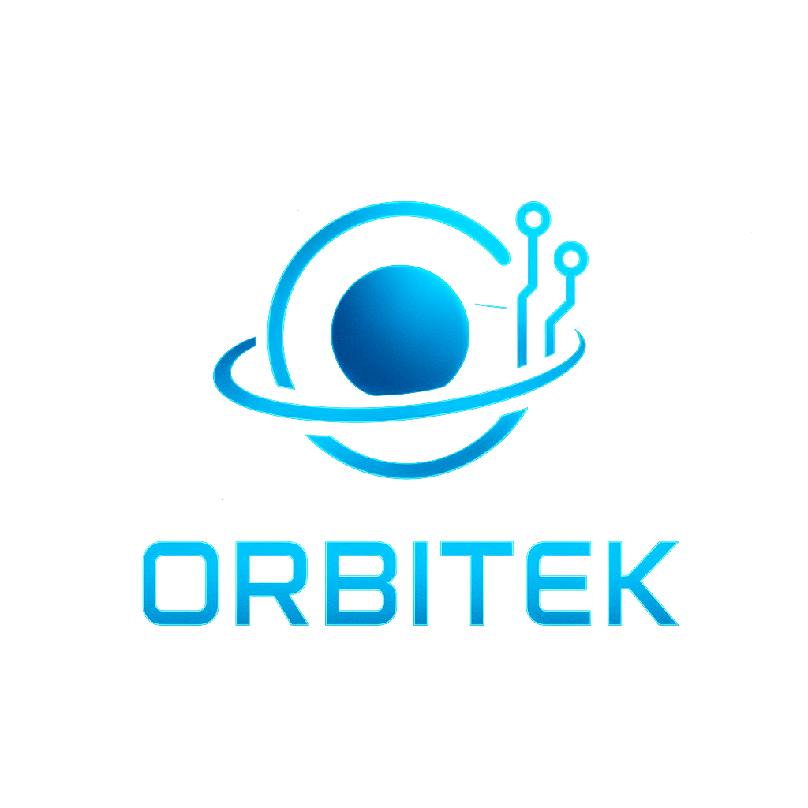

<html lang="en">
<head>
  <meta charset="UTF-8" />
  <meta name="viewport" content="width=device-width, initial-scale=1.0" />
  <title>Orbitek (OBT)</title>
  
</head>
<body>
  
  <h1>Orbitek (OBT)</h1>
  
Token futurista DeFi na rede Solana. Orbitek traz velocidade, tecnologia e uma comunidade forte para dominar o espaço cripto.

  <button class="buy-button">Buy OBT</button>
</body>
</html>
